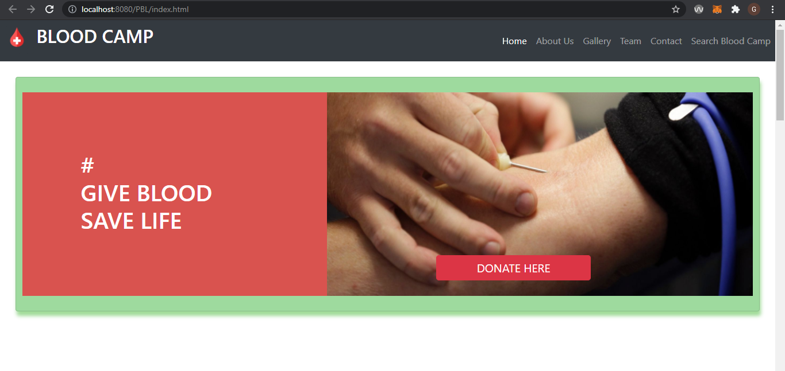
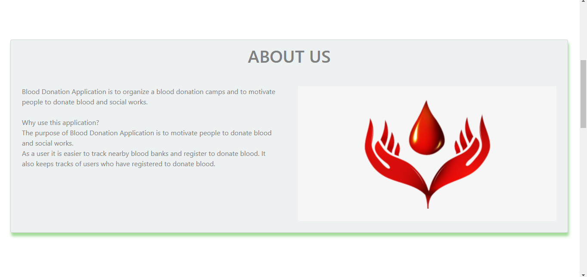
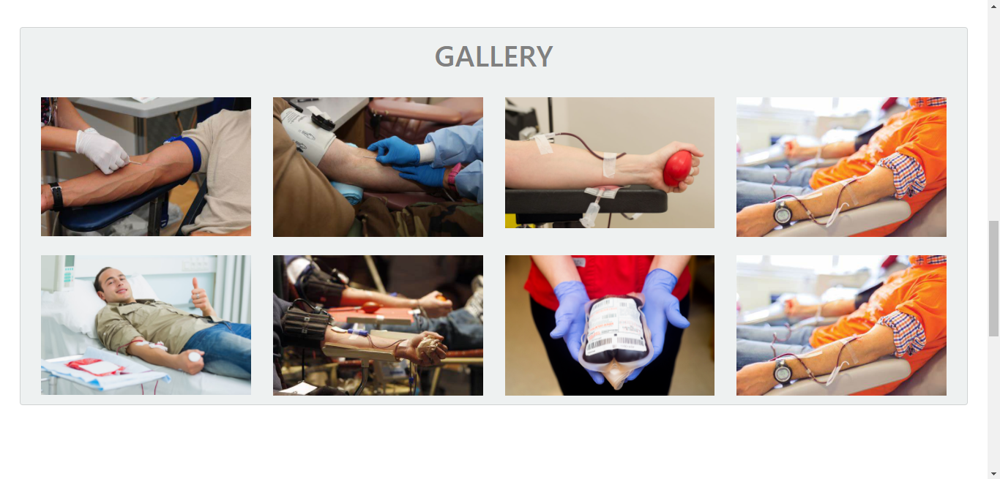
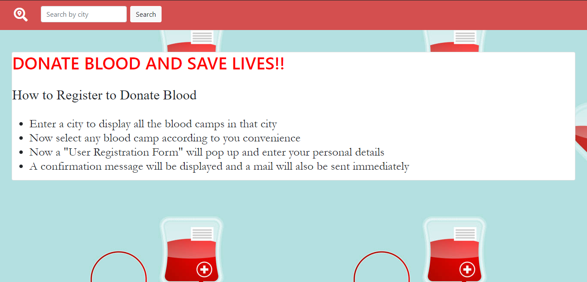
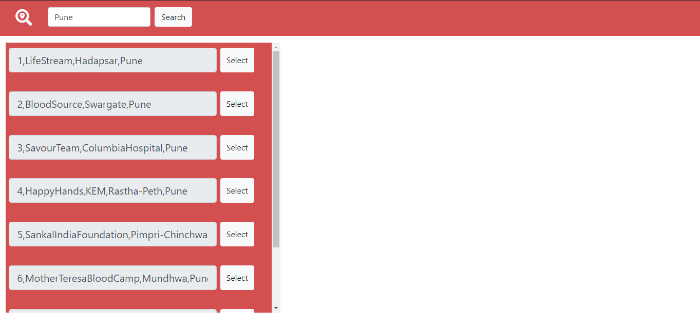
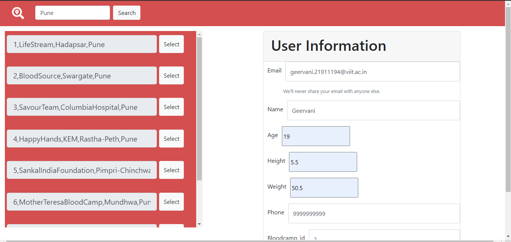
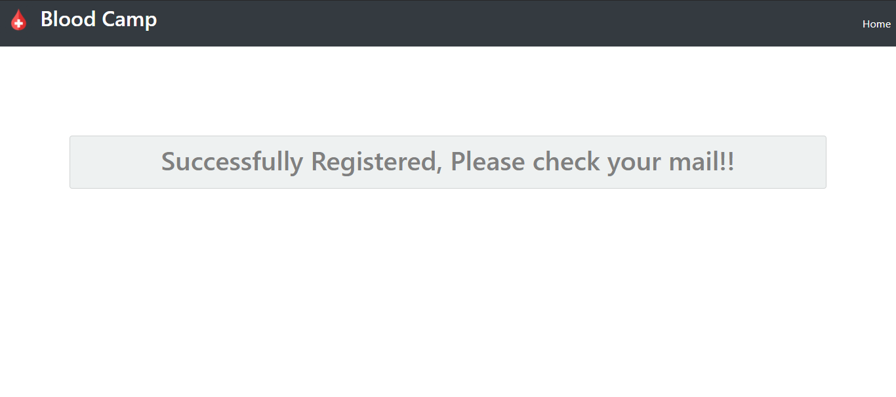

# Blood-Donation-System
An application to organize a blood donation camp and to motivate people to donate blood and social works.
Users can search for blood camps in nearby vicinty and can register in one. After successful registration, user will be notified via his/her mail.

## Technology Stack
* **Frontend:** [HTML](https://html.com/), [CSS](https://developer.mozilla.org/en-US/docs/Web/CSS), [Bootstrap](https://getbootstrap.com/)
* **Backend:** [Java Servlets](https://www.javatpoint.com/servlet-tutorial), [JSP(jakarta server pages)](https://www.javatpoint.com/jsp-tutorial)
* **Database:** [MySQL](https://www.mysql.com/)

## Requirements
* [Eclipse IDE](https://www.eclipse.org/)
* MySQL Workbench
* Additional Requirements: 
  Right click on the project, Select properties and go to java build path and add add the following external JAR's
    1.  [JDBC Connectivity with MySQL](https://www.javatpoint.com/example-to-connect-to-the-mysql-database) 
    2.  [Java Mail API](https://www.javatpoint.com/java-mail-api-tutorial)
    3.  Java Activation Framework (JAF)
    4.  [Apache Tomcat server](https://tomcat.apache.org/index.html) (if not present)

## Website Preview

